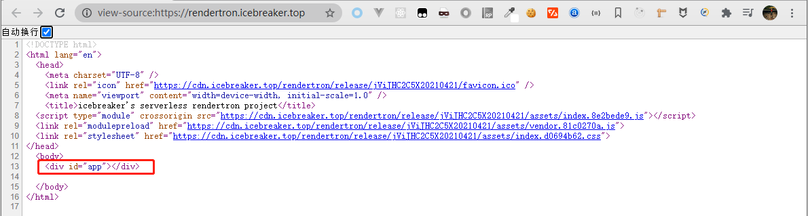
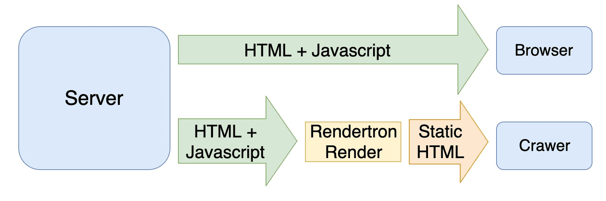
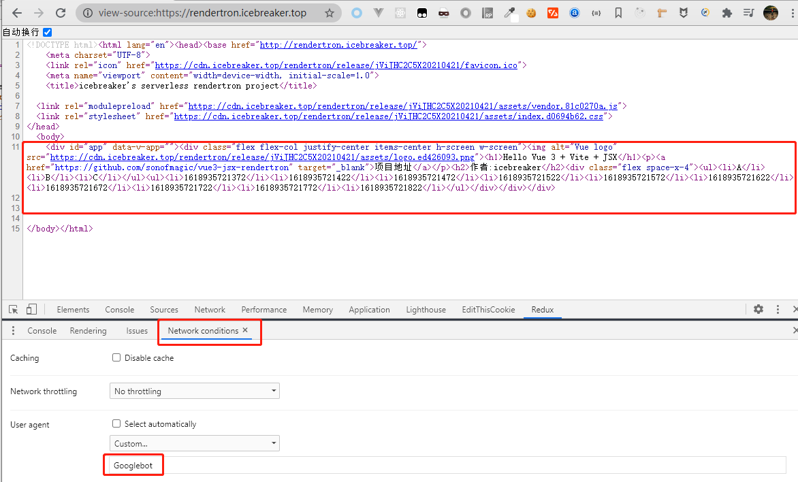

# serverless 场景下的 rendertron 方案

## 什么是 rendertron ?

rendertron 是 Google 团队的一个对网页进行渲染的项目

它利用 `headless chromium` 对指定的网页进行实时渲染

<!-- 由于会执行其中的 js 代码，尤其适合 spa(client side render) 应用的场景 -->

<!-- 一言以蔽之：**面对爬虫渲染** -->

## 为什么会出现这个项目？

`vue / react` 这类框架的兴起，给前端开发带来了巨大的变化

然而默认他们都是使用的 csr

这带来一个问题，由于 spa 应用 中绝大部分的 `html dom` 都是由 `js` 去控制产生销毁的

我们浏览器访问一个这样的应用，去查看源代码的话

只能看到引入了大批的 js 文件，并没有任何显示的数据

如图：



一些 **老爬虫** 的视角也是如此，他并不会执行其中的 `js`

也就没法通过里面的 `xhr` 等等异步方式去获取数据，给 `body` 里面添加内容

所以以它们的视角来看，我们的 `spa` 应用简直可以用空无一物来形容

这就对我们做 `seo` 带来了问题

## 解决问题的几种方案

### prerender

预渲染技术也是使用 `puppeteer`，在我们 `spa` 项目打包完成的阶段，预先 host 这些静态文件，然后使用 headless chrome 先去渲染它指定的页面，把渲染好的 html 抽离，和 spa 项目一起按照目录的结构部署

这种方案最大的优点是非常的方便 , 小项目使用非常的灵活

不过，假如说有一个动态页面，要根据百万量级数据去生成百万个静态的 html

这种方案显然是无法接受的，毕竟渲染这么大的量很花时间，部署的话，这么多静态的东西占用空间也很大，得不偿失

### server side render

之前我选用的就是 `ssr` 的解决方案

`vue / react` 项目都有对应成熟框架

比如 `nuxt/next/umi` , `ssr` 方案能解决一些问题，
比如说首屏渲染问题，还有 `seo` 的一些 `meta` 信息，也可以在服务端组装好返回
而且对前端开发来说，由于 `nodejs` 扮演角色的升级，能做的事情也更多了

不过可能也存在一些问题：

- 对已经开发好的 `spa` 项目，有可能改造成本比较高

- 对前端开发人员，有更高的技术要求，要清楚哪些代码跑在 `nodejs`，哪些在`brower`，而哪些二者都在跑

然而他的优点也是显而易见的 , 推荐大家采用这种方案去搞 `seo`

<!-- 在webpack的动态引入还未出现的时代，spa应用一次性引入所有的js过大 -->

### rendertron

<!-- 前面说了 ssr 这么多好处，为啥我们还需要 rendertron 方案呢 -->

rendertron 这种方案，给我们在 spa 应用无法改造时候多一条出路

他可以在尽可能少改造原先的项目的情况下，达成我们 seo 的部分目的

原理实际上也非常简单：



通过使用 `Headless Chrome` 在内存中执行 `Javascript`，并在得到完整内容后，将内容返回给客户端。

## rendertron 的 serverless 实践

`rendertron` 本身只是一个 `puppeteer` 和 `koa` 的封装, 可以作为一个`koa`应用直接部署。

在阿里云 `serverless`，通过 `fun` 的配置项，可以直接部署一个 `rendertron` 应用

而腾讯云 `serverless`, 也已经内置了 `chromium` , 我们也只需要安装 `puppeteer` ，不需要上传任何的二进制文件，就能直接使用了

> 目前腾讯云 SCF 内置版本是 HeadlessChrome/80.0.3987.0 (2021.04.19)

本文章以腾讯云 serverless 作为示例，毕竟直接部署一个现成的 `rendertron` 太无趣了，可操作的空间不多

### Step1

创建一个任意的 `spa` 应用，比如 `vite` + `vue3` , 随便写一点 `xhr` , 异步的渲染, 作为 `demo`

### Step2

创建一个 `express` 应用,用 `history-api-fallback` 去处理 `history` 路由的 spa 应用的 `index.html`

安装 `rendertron` ，我们不需要初始化 一个 `Rendertron` 实例，只借用他的 `Renderer` 中的策略

创建 `Renderer` 实例之后，我们就有了自己的 `browser` 和 `renderer` 了

然后简单写个 **中间件** , 用 `isBot` 判断是不是爬虫

是爬虫就 去判断缓存，没有命中就把爬虫访问的 `fullPath` 的页面，用 `Renderer` 去实时渲染，然后返回给爬虫，并置缓存

是用户就正常返回 `index.html`

例如：
```js
// 以cloudbase json db为例
const rendererMiddleware = async (req, res, next) => {
  const ua = req.get('user-agent')
  const botFlag = isbot(ua)
  if (botFlag) {
    const fullURL = req.protocol + '://' + req.get('host') + req.originalUrl

    const { data } = await pageCacheCol
      .where({
        url: fullURL
      })
      .get()
    if (data.length) {
      const hit = data[0]

      // 由于实时渲染，又慢内存消耗又大，建议使用永久缓存，通过检测xhr获得数据的变化，手动去刷新缓存
      res.send(hit.content)
      // 半小时的cache 方案（废弃）
      // const ts = Date.now()
      // if (ts - hit.ts <= 1000 * 60 * 30) {
      //   res.send(hit.content)
      // } else {
      //   await rendererWithInsetDb()
      // }
    } else {
      const result = await rendererMoudle.renderer.serialize(fullURL, true)
      res.send(result.content)
      await pageCacheCol.add({
        url: fullURL,
        // ts: Date.now(),
        content: result.content
      })
    }
  } else {
    next()
  }
}
```

这样，基于 `SCF` 的一个自定义的 `rendertron` 就完成了

## 效果展示

<!-- ### 用户源码视图 -->

### 爬虫视角(Googlebot)



效果可以直接上 [https://rendertron.icebreaker.top/](https://rendertron.icebreaker.top/) 查看

## 总结

<!-- 这个方案其实就是给爬虫看渲染过的页面 -->

这个方案对于我们的用户来说，体验的就是最纯正的 `spa` 应用，

像 `ssr` 应用，假如不做页面/组件/数据这方面的缓存的话，复杂页面的渲染实际上也是比较慢的。

而这种方案去实时渲染的话 , 计算负担相当于从 nodejs `server side` 的渲染引擎 那里，转移到了 `chromium` 这里

简直就是：

**又慢 , 又非常的耗内存**

<!-- 如果做 seo 改造方案的话 -->

假如项目改造成本不高，建议直接上 ssr

假如需要采用这种方案的话，也比较适合做永久缓存，然后根据页面数据的变化，在推送 `job` 中手动刷新指定路由的缓存，然后去更新指定的 `sitemap` 中的 `lastmod` 字段 ，再 **主动推送** 给搜索引擎

而使用缓存过期的策略，不如每天凌晨，用 job 全部手动渲染，刷一遍缓存要好。

不过页面或者数据量大的情况下，也比较花时间花内存。

得不偿失。
<!-- 而且由于 chromium 的内置，也能比较好的处理一些特殊的需求（笑~） -->

<!-- 一句话总结，有条件的话，直接上 ssr ，自己有 chromium 服务的话，可以考虑这种方案 -->

## 附录

[Github rendertron 项目地址](https://github.com/GoogleChrome/rendertron)

[阿里云开发者社区-文章](https://developer.aliyun.com/article/739001)

[本项目源码](https://github.com/sonofmagic/vue3-jsx-rendertron)
